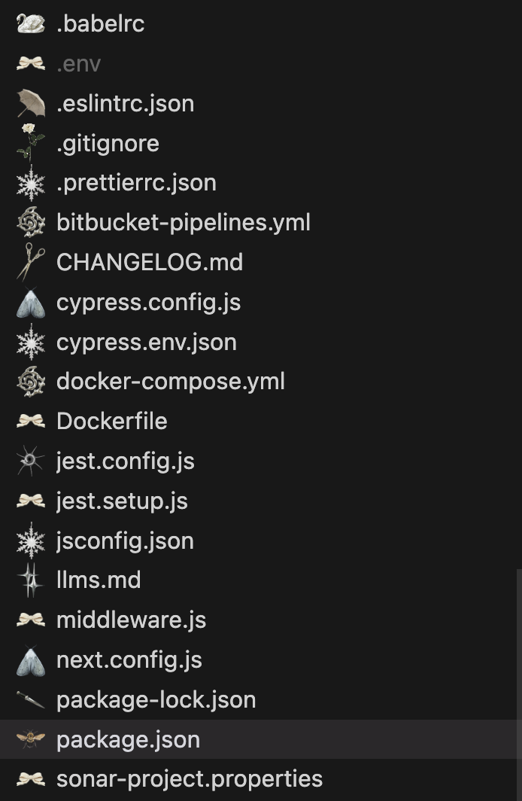

## Dull Icon Theme

A calm, monochrome icon theme for focused workspaces.

---



---

### 🐇 Installation

[**From the Marketplace →**](https://marketplace.visualstudio.com/items?itemName=pnxu.dull-icon-theme)

or manually from VS Code:

```bash
code --install-extension pnxu.dull-icon-theme@0.0.3
```

### 🌱 Activation

After installing, open the Command Palette (Ctrl + Shift + P / ⌘ + Shift + P) and select

`Preferences: File Icon Theme → Dull Icon Theme`

#### 🖤 Author

Created by [pnxu](https://github.com/pnxu/dull-icon-theme)

For those who prefer silence and subtlety.